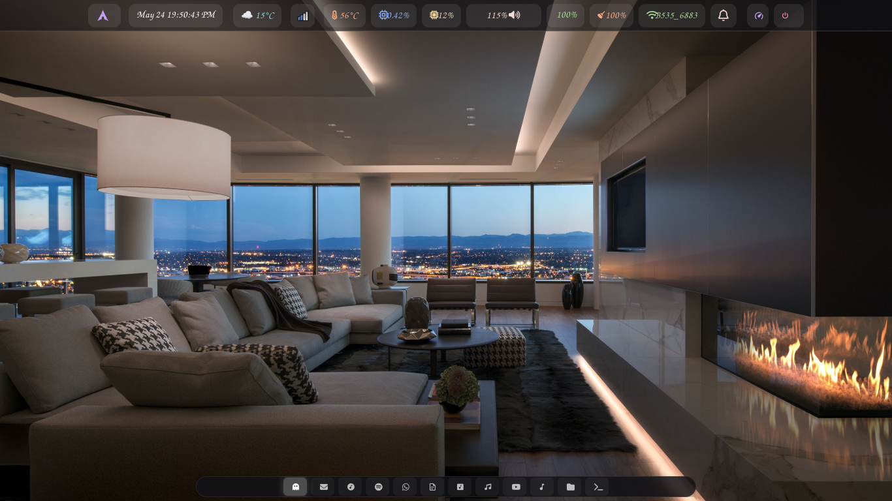
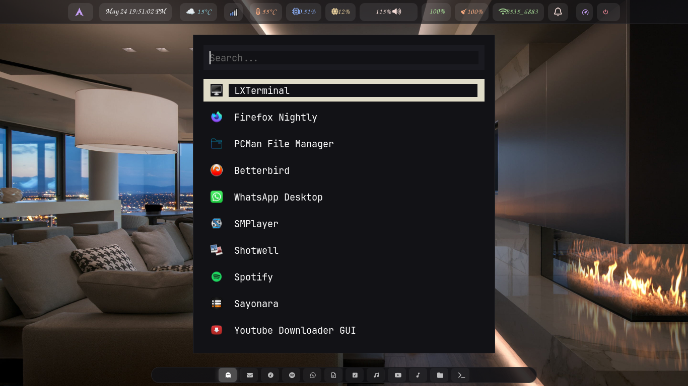

# Niri Dotfiles

  

Scrollable-tiling Wayland Compositor with KDL configuration.

---

## ✨ Features
- **Dual Waybar:** A centered top bar for system metrics and a bottom dock for 11 icon-based workspaces.
- **Config:** Modular `config.kdl` and `keybinds.kdl` setup.
- **Scripts:** Custom bash/python utilities for power management, screenshots, and weather.
- **Window Rules:** Extensive pre-configured rules for app sizing, floating, and opacity.

## 📖 Documentation & Installation

For full instructions, including how to handle Niri's Waybar symlink quirk, keybinds, and window rules, please visit the **[Official Documentation Website](https://wgparch.codeberg.page/niri/)**.

## 📸 Screenshots

